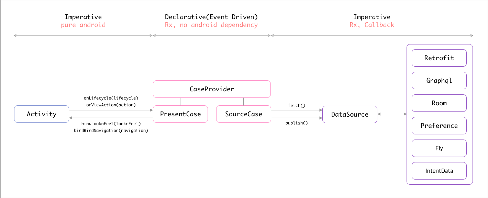

# 🔥 Model-View-CaseProvider



# 📌 Intro

- MVCP 는 아래와 같은 조건들을 충족시키기위해 구성된 아키텍쳐입니다.
  - View 의 데이터 복구는 View 스스로 할 수 있어야 합니다.
  - View 의 데이터와 외부 데이터는 상호 디펜던시가 없어야 합니다.
  - 외부 데이터의 구조가 변경되어도 외부 데이터를 뷰 데이터로 변환시키는 부분만 변경되고 나머지는 변경되지 않아야 합니다.
  - 패러다임의 변화로 새로운 Architecture 로(ex. MVP) 변경해야할 필요가 있을 때 최소한의 변경만으로 Architecture 전환이 가능해야 합니다.
  - 다양한 기획 요구 사항이 들어오더라도 Architecture 의 기본이 깨지면 안 됩니다.
  - 비지니스 로직 부분에서 android 관련 dependency 를 최대한 제거해 iOS 에서도 비슷한 코드로 구성이 가능해야 합니다.
  - (Unit/Instrumentation) Testable 해야 합니다.
  
- MVCP 는 아래와 같은 전제 조건들 아래 구성된 아키텍쳐입니다.
  - V 는 멍청하지 않습니다. 똑똑합니다.
  - V 에는 Rx 와 같은 외부 라이브러리에 대한 디펜던시가 존재하지 않아야 합니다.
  - 비지니스 로직을 담당하는 CP 는 명령형이 아닌 선언형 기반(Event-Driven)입니다. (feat. RxJava)
  - CP 에는 데이터 관련 클래스에 대한 직접적인 디펜던시가 없습니다. CP 는 상황에 따라 데이터 전달자의 역할만 합니다. 
  - CP, DataSource 에서는 최대한 android dependency 를 최대한 제거합니다. (ex, Context, Resources, etc)
    - ex) DataSource 에서 외부 데이터를 변환할 때 strings.xml 의 값이 필요할 경우 Mapper 클래스를 따로 만들어서 Resources 에 대한 디펜던스를 Mapper 가 가져가도록 합니다.

# 📌 Components

- MVCP 각각의 구성요소에 대해 설명합니다.

## View

- Activity, Fragment, Layout 등을 의미합니다.
- Activity 나 Fragment 는 오직 하나의 Custom Layout 만 가지게 됩니다.
  - 해당 Custom Layout 이 Activity 나 Fragment 에 필요한 뷰들을 전부 가지고 있습니다.
  - 아래는 LoginActivity 의 xml 인 activity_login.xml 입니다.
  
``` xml
<com.my.package.LoginLayout xmlns:android="http://schemas.android.com/apk/res/android"
    xmlns:tools="http://schemas.android.com/tools"
    android:id="@+id/custom_fl_login"
    android:layout_width="match_parent"
    android:layout_height="match_parent"
    tools:context="com.my.package.LoginLayout" />
```

- Activity 나 Fragment 에 존재하는 하나의 Root layout 은 아래와 같은 기본 시그니쳐를 가지고 됩니다.
  - LooknFeel 클래스는 Layout 구성에 필요한 View Data 를 담고 있는 클래스입니다.
  - 이 RootLayout 은 뷰가 스스로 할 수 있는 동작은 최대한 스스로 하도록 구성합니다. 
    - 예) 비밀번호 4자리를 입력했을 경우 로그인 버튼을 활성화 시키는 UX 가 있다고 가정하면 이 동작은 외부 데이터가 필요없으니 CP 나 ViewModel 혹은 Activity 가 전혀 관여하지 않고 View 가 알아서 로그인 버튼을 활성화 시킵니다.
      - Activity 로 onPasswordFullfilled 같은 콜백을 주지 않음

``` kotlin
internal class RootLayout constructor(
        context: Context,
        attrs: AttributeSet? = null

) : FrameLayout(context, attrs) {

    interface Listener {
        // TODO 외부로 응답 줄 콜백 함수 정의
    }

    @Parcelize
    class LooknFeel : Parcelable

    private var listener: Listener? = null

    init {
        LayoutInflater.from(context).inflate(R.layout.view_root, this, true)

        initializeListener()
    }
    
    fun setLooknFeel(looknFeel: LooknFeel) {
        this.looknFeel = looknFeel
        
        // TODO 
    }
    
    fun setListener(listener: Listener) {
        this.listener = listener
    }

    private fun initializeListener() {
        // TODO
    }
    
    override fun onRestoreInstanceState(state: Parcelable?) {
        
        state is SavedState) {
            super.onRestoreInstanceState(state.superState)

            looknFeel = state.looknFeel

            looknFeel?.let(this::setLooknFeel)
        } else {
            super.onRestoreInstanceState(state)
        }
    }

    override fun onSaveInstanceState(): Parcelable? {
        val parcelable = super.onSaveInstanceState()

        if (parcelable == null) {
            return parcelable
        }

        return SavedState(parcelable).apply {
            this.looknFeel = this@RootLayout.looknFeel
        }
    }
    
    private class SavedState : View.BaseSavedState {
        companion object {
            @JvmField
            val CREATOR = object : Parcelable.Creator<SavedState> {
                override fun createFromParcel(source: Parcel): SavedState {
                    return SavedState(source)
                }

                override fun newArray(size: Int): Array<SavedState?> {
                    return arrayOfNulls(size)
                }
            }
        }

        var looknFeel: LooknFeel? = null

        constructor(superState: Parcelable) : super(superState)

        private constructor(source: Parcel) : super(source) {
            this.looknFeel = source.readParcelable(LooknFeel::class.java.classLoader)
        }

        override fun writeToParcel(out: Parcel, flags: Int) {
            super.writeToParcel(out, flags)

            out.writeParcelable(looknFeel, flags)
        }
    }

}
```

- Activity 는 아래와 같은 기본 시그니쳐를 가지고 있습니다.
    - Activity 는 MVCP 중 PresentCaseApi 와 만 통신합니다.

    ``` kotlin
    internal class LoginActivity : AppCompatActivity(), LoginView {

        @Inject lateinit var viewModelProviderFactory: ViewModelProviderFactory

        private val viewModel by lazy { ViewModelProviders.of(this, viewModelProviderFactory)[LoginViewModel::class.java] }

        override fun onCreate(savedInstanceState: Bundle?) {
            AndroidInjection.inject(this)

            super.onCreate(savedInstanceState)
            setContentView(R.layout.activity_login)

            initializeListener()

            viewModel.presentCase.setView(WeakReference(this))

            viewModel.presentCase.onLifecycle(LifecycleState.OnCreate(intent, savedInstanceState))
        }

        override fun bindLooknFeel(looknFeelCase: LoginLooknFeelCase) {
            when(looknFeelCase) {
                is LoginLooknFeelCase.BindLooknFeel -> custom_fl_login.setLooknFeel(looknFeelCase.looknFeel)
            }
        }

        override fun bindNavigation(navigationCase: LoginNavigationCase) {
            when(navigationCase) {
                is LoginNavigationCase.ToNext -> { /** TODO navigate to next */ }
            }
        }

        private fun initializeListener() {
            custom_fl_login.setListener(object : LoginLayout.Listener {
                override fun onLoginClicked(id: String, password: String) {
                    viewModel.presentCase.onViewAction(LoginViewAction.Click.Login(id, password))
                }
            })
        }

    }
    ```

  - Activity 는 해당화면의 이름을 가진 View 를 Implementation 합니다. 위의 예제에서는 LoginView

  ``` kotlin
  internal interface LoginView {
    fun bindLooknFeelCase(looknFeelCase: LoginLooknFeelCase)
    fun bindNavigationCase(navigationCase: LoginNavigationCase)
  }
  ```

  - LoginLooknFeelCase, LoginNavigationCase 는 Activity 와 PresentApi 의 통신에 사용되는 데이터를 담는 클래스 입니다.

  ```kotlin
  internal sealed class LoginLooknFeelCase {
    class BindLooknFeel(val looknFeel: LoginLayout.LooknFeel) : LoginLooknFeelCase()
  }

  internal sealed class LoginNavigationCase {
    class ToNext(val nextScreenIntentData: NextIntentData) : LoginNavigationCase()
  }
  ```

  - 즉, Activity 는 {ActivityName}View 라는 interface 로 외부(PresentCaseApi)와 통신하게 됩니다. 
    - 또 이는 즉, 외부요소는 acitivty 의 fun bindLooknFeelCase(..), fun bindNavigationCase(..) 이 두 함수만 호출할 수 있다는 것을 의미합니다.

## ViewModel
  - ViewModel 은 configuration change 때 기존에 존재하는 Model 과 CaseProvider 의 instance 를 계속 유지하기 위해서만 사용됩니다.
  - 비지니스 로직은 ViewModel 에 포함되지 않습니다.
  - 아래는 ViewModel 기본 시그니쳐 입니다.

  ``` kotlin
  internal class LoginViewModel @Inject constructor(
                val presentCase: LoginPresentCaseApi,
        private val sourCase: LoginSourceCaseApi,
        private val caseProvider: LoginCaseProviderApi

  ) : ViewModel() {

    override fun onCleared() {
        super.onCleared()

        caseProvider.disposable().clear()
    }

  }
  ```

## CaseProvider
  - CaseProvider 는 View 와 DataSource 에서 일어나는 이벤트들을 선언적으로 정의해놓은 클래스 입니다.
  - CaseProvider 에 정의되는 이벤트 들을 View 에 데이터를 Bind 하는 PresentCase 와 DataSource 로부터 데이터를 fetch 해오거나 publish 하는 SourceCase 두 곳에서 사용합니다.
  - CaseProvider 의 기본 시그니쳐는 아래와 같습니다.

  ``` kotlin
  internal class LoginCaseProvider @Inject constructor(
      private val channel: LoginChannelApi

  ) : LoginCaseProviderApi {

    private val lifecycleCase by lazy(LazyThreadSafetyMode.NONE, this::LifecycleCase)

    private val viewActionCase by lazy(LazyThreadSafetyMode.NONE, this::ViewActionCase)

    private val dataCase by lazy(LazyThreadSafetyMode.NONE, this::DataCase)

    inner class LifecycleCase {
      private val lifecycle = channel.ofLifecycle()

      private val onCreate = lifecycle.ofType<LifecycleState.OnCreate>()
    }

    inner class ViewActionCase {
      private val viewAction = channel.ofViewAction()

      val loginClicked = viewAction.ofType<LoginViewAction.Click.Login>()
    }

    inner class DataCase {
      private val data = channel.ofData()

      val loginLooknFeelFetched = data.ofType<LoginDataCase.LoginLooknFeelFetched>

      val loginSuccessFetched = data.ofType<LoginDataCase.LoginSuccessFetched>()
    }

    override fun channel() = channel

    override fun disposable() = disposable.get()

    override fun viewActionCase() = viewAction

    override fun lifecycleCase() = lifecycle

    override fun dataCase() = dataCase

  }
  ```

## PresentCase
  - PresentCase 는 CaseProvider 에 명세된 이벤트(상황)들을 사용/조합해 View 에 특정 명령을 실행하는 구성요소입니다.
  - PresentCase 의 기본 시그니쳐는 아래와 같습니다.
  - PresentCase 에는 데이터를 담는 클래스를 Injection 받거나 내부 변수로 선언하지 않습니다.
    - 특정 데이터가 필요할 경우 DataSource 에서 fetch 해오고 이를 SourceCase 에서 이벤트로 발송해서 해당 이벤트를 사용하는 형식으로 구성합니다..
        - 아래 caseProvider.dataCase().loginSuccessFetched 에서 userName 을 가져온 것처럼 사용하면 됩니다.
  - setView 함수가 따로 있는 이유는 configuration change 될 때 activity 는 재생성되지만 ViewModel 이 이 PresentCase 를 들고 있어서 PresentCase 는 재생성되지 않으므로 acitivity 가 onCreate 될 때마다 PresentCase 로 재생성된 activity 를 set 하기 위해 존재합니다.

  ``` kotlin
  internal class LoginPresentCase @Inject constructor(
        private val caseProvider: LoginCaseProviderApi

  ) : LoginPresentCaseApi {

    private var weakView: WeakReference<LoginView>? = null

    private val looknFeelCase by lazy(LazyThreadSafetyMode.NONE, ::LooknFeelCase)

    private val navigationCase by lazy(LazyThreadSafetyMode.NONE, ::NavigationCase)

    inner class LooknFeelCase {
        val bindLooknFeel = caseProvider.dataCase().loginLooknFeelFetched
                .map { LoginLooknFeelCase.BindLoginLooknFeel(it.looknFeel) }
    }

    inner class NavigationCase {
        val navigateToNext = caseProvider.dataCase().loginSuccessFetched
                .map { LoginNavigationCase.ToNext(NextIntenttData(userName = it.userName)) }
    }

    init {
        caseProvider.disposable().addAll(
                looknFeelCase.bindLooknFeel
                        .subscribeOf(onNext = { weakView.get()?.bindLooknFeelCase(it) }),

                navigationCase.navigateToNext
                        .subscribeOf(onNext = { weakView.get()?.bindNavigationCase(it) })
        )
    }

    override fun setView(weakView: WeakReference<LoginView>) {
        this.weakView = weakView
    }

    override fun onLifecycle(lifecycleState: LifecycleState) = caseProvider.channel().accept(lifecycleState)

    override fun onViewAction(viewActionCase: LoginViewActionCase) = caseProvider.channel().accept(viewActionCase)

  }
  ```

## SourceCase
  - SourceCase 는 CaseProvider 에 명세된 이벤트(상황)들을 사용/조합해 DataSource 로부터 데이터를 fetch 해오거나 데이터를 publish 하는 구성요소 입니다.
  - SourceCase 의 기본 시그니쳐는 아래와 같습니다.
  - Fetch 안에 있는 변수의 네이밍은 SourceCase 입장에서 무엇을 fetch 하는지를 적습니다.
  - Publbish 안에 있는 변수의 네이밍은 SourceCase 입장에서 무엇을 publish 하는지를 적습니다.

  ``` kotlin
  internal class LoginSourceCase @Inject constructor(
          private val caseProvider: LoginCaseProviderApi,
          private val dataSource: LoginDataSourceApi,
          private val schedulerProvider: SchedulerProviderApi

  ) : LoginSourceCaseApi {

    private val fetch by lazy(LazyThreadSafetyMode.NONE, ::Fetch)

    private val publish by lazy(LazyThreadSafetyMode.NONE, ::Publish)

    inner class Fetch {
        val fetchedLoginLooknfeel = caseProvider.lifecycleCase().onCreate
                .switchMap { dataSource.fetchLoginLooknFeel() }

        val loginSuccess = caseProvider.viewActionCase().loginClicked
                .observeOn(schedulerProvider.io())
                .switchMap { dataSource.fetchLogin(it.id, it.password) }
                .filter { it.isSuccessful }
    } 

    inner class Publish 

    init {
        caseProvider.disposable().addAll(
                Observable.merge(
                    fetch.fetchedLoginLooknfeel,
                    fetch.loginSuccess
                )
                        .observeOn(schedulerProvider.main())
                        .subscribeOf(onNext = { caseProvider.channel().accept(it) })
        )
    }
  }
  ```

## PresentCase && SourceCase
  - PresentCase 와 SourceCase 는 특정 **상황** 때 이 상황에 해당하는 **데이터** 를 전달하는 역할만 합니다.
  - 상황에 따른 분기처리는 존재하지만 세부 데이터에 따른 분기처리는 최대한 존재하지 않도록 작성합니다.
  - 예외) 외부 데이터가 아닌 뷰 데이터로는 분기처리는 가능토록 합니다.

## DataSource
 - SourceCase 의 명령에 따라 Database, Network, MemoryCache, Intent 등에서 부터 View 가 필요한 데이터를 응답해주는 구성요소입니다.
 - View 데이터(ex, LooknFeel) 가 아닌 외부 요소와 관련된 모든 데이터는 여기 DataSource 로 부터 가져오게 됩니다.
 - DataSource 의 기본 시그니쳐는 아래와 같습니다.

 ``` kotlin
 internal class LoginDataSource @Inject constructor(
        private val api: KnowreApi,
        private val mapper: LoginLooknFeelMapper,
        private val userFlty: UserFlyApi,
        private val intentData: LoginIntentData

  ) : LoginDataSourceApi {

    companion object {
        const val NOTHING = "nothing"
    }

    override fun fetchLoginLooknFeel(): Observable<LoginDataCase.LoginLooknFeelFetched> {
        return Observable.just(NOTHING)
                .map { LoginDataCase.LoginLooknFeelFetched(mapper.transform(intentData)) }
    }

    override fun fetchLogin(id: String, password: String): Observable<LoginDataCase.LoginFetched> {
        return api.login(id, password)
                .map { LoginDataCase.LoginFetched(it.isSuccessful) }
    }

  }
 ```

 - LoginDataCase 는 DataSource 에서 SourceCase 로 응답주는 스트림의 Type 입니다.

 ``` kotlin
 internal sealed class LoginDataCase {
    class LoginLooknFeelFetched(val looknFeel: LoginLayout.LooknFeel) : LoginDataCase()
    
    class LoginFetched(val isSuccessful: Boolean) : LoginDataCase()
  }
 ```

# 📌 Pros and Cons

## Pros
  - View 가 똑똑하므로 애니메이션이나 비디오 플레이 등과 관련된 뷰에서만 일어나는 데이터에 대해서 configuration change 대응이 유연합니다.
    - ViewModel 에서 view 의 데이터를 관리한다면 animation, playback position 등등 과 같은 데이터를 전부 ViewModel 로 갱신해야 합니다.
  - CaseProvider 는 선언형 기반으로 UX 변경 및 데이터 변경 시 이벤트의 조합으로 비교적 유연하게 대처가 가능합니다.
  - Analytics 기능과 같이 새로운 기능이 필요할 때 비지니스 로직을 건드리지 않으면서 아래와 같이 기능을 쉽게 붙일 수 있습니다.
  ``` kotlin
  internal class AnalyticsReport @Inject constructor(
        private val caseProvider: LoginCaseProviderApi,
        private val firebaseReporter: FirebaseReporter

  ) {

    init {
        caseProvider.disposable().addAll(
            caseProvider.viewActionCase().loginClicked()
                    .subscribeOf(
                        onNext = {
                            firebaseReporter.report("로그인 버튼 클릭")
                        }
                    )
        )
    }

  }
  
  // 명령형 기반일 경우 아래와 같이 비지니스 로직사이에 리포트 기능이 포함되어야합니다.

  internal class LoginPresenter @Inject constructor(
        private val api: Api,
        private val firebaseReporter: FirebaseReporter

  ) {

    fun onLoginClicked(id: String, password: String) {
        firebaseReporter.report("로그인 버튼 클릭")

        api.login(id, password)

        //TODO do something
    }

  }
  ```

## Cons
  - 선언형 기반으로 작성하다보니 디버깅이 비교적 어렵습니다.
  - View(Layout) 가 똑똑해야하므로 View 에 코드가 많아지게 되고 View 에는 Rx 같은 라이브러리를 사용하지 못하므로 복잡한 뷰를 구성할 때 코드 작성이 어려울 수 있습니다.

# 끝.
